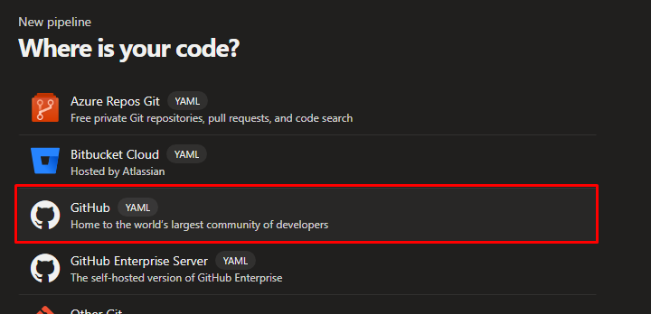

# Última entrega - Despliegue de Software

## CI/CD

### Integrantes

- Juan Sebastian Cardona Serna
- Juan Manuel Valencia Giraldo
- Harold Alberto Mena Parra
- Harrison Alonso Arroyave Gaviria
- Dairo Andres Mosquera Blandon

### Enlaces de los videos

CI: https://youtu.be/IRt-kkqAOG8

CD: https://youtu.be/_gxmweXasfw

### URL de la aplicación

https://pokemonfinder-fxdxejdyeabheffy.canadacentral-01.azurewebsites.net/

### Pasos realizados

1. Después de crear la organización y el proyecto en Azure DevOps, se crea un
   pipeline en la sección de Pipelines, seleccionando la opción de
   "Create Pipeline":

   

2. Se selecciona la fuente del código, en este caso GitHub:

   

3. Se selecciona el repositorio del código:

   

4. Si ya existe un archivo azure-pipelines.yml, se mostrará su contenido. Si no
   existe, se le mostrará uno nuevo para configurar:

   

5. Al ejecutar el pipeline, se mostrará el resultado de cada paso del job:

    

6. Revise el archivo [azure-pipelines.yml](./azure-pipelines.yml). Cada tarea
   tiene una descripción de lo que hace. Este pipeline ya está configurado para
   crear el artefacto y desplegar la aplicación en el App Service de Azure.

   El despliegue se realiza en la última tarea, la cual tiene la siguiente
   configuración:

   ```yaml
    - task: AzureWebApp@1
    displayName: 'Desplegar en Azure'
    inputs:
        appType: webApp
        azureSubscription: 'AzureConnection'
        appName: 'PokemonFinder'
        package: '$(outputPath)/Ecommerce.API.zip'
   ```

   Donde:

   - `appType`: Tipo de aplicación, en este caso webApp.
   - `azureSubscription`: Nombre de la conexión a Azure (explicado en el paso 7).
   - `appName`: Nombre del App Service.
   - `package`: Ruta del archivo zip que se va a desplegar.

7. Para configurar la conexión a Azure, se debe ir a la sección de Pipelines en
   la configuración del proyecto, luego a la sección de "Service connections" y
   finalmente a la pestaña de "New service connection". Se selecciona "Azure Resource Manager" y se configura el resource group y el nombre de la conexión
   (en este caso "AzureConnection") que se usará en el pipeline en el input
   `azureSubscription`:

   

   

   

   

8. Cuando todo esté configurado, se puede ejecutar el pipeline. Es posible que
   se muestre un error de permiso denegado en la conexión a Azure. Si es el caso,
   haga click en "View" y posteriormente en "Permit":

    

    

    

    

9. El pipeline debería ejecutarse sin problemas y desplegar la aplicación en el
   App Service de Azure:

    

    

    
